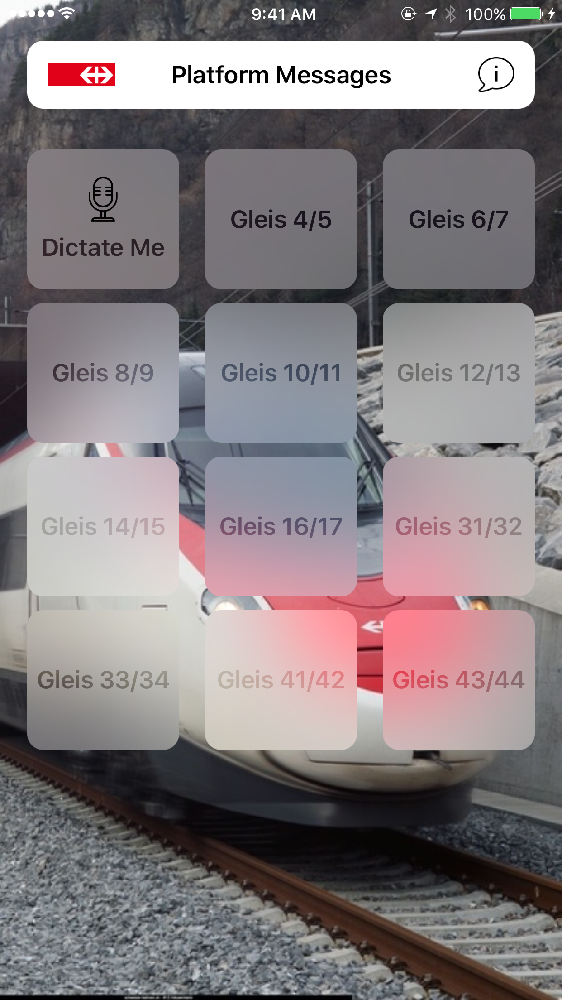
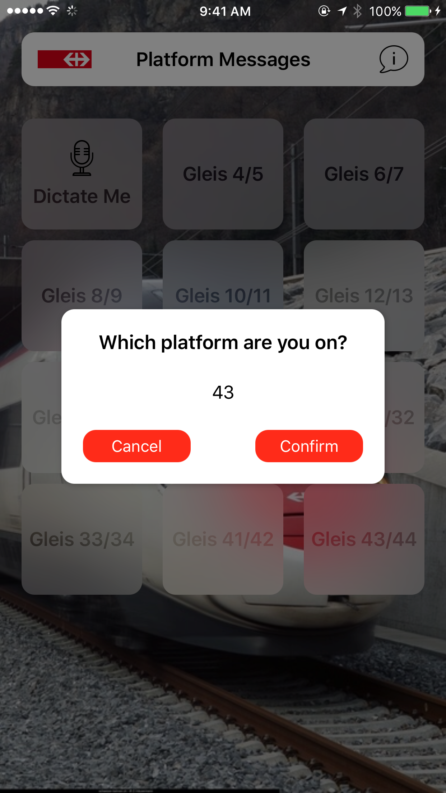
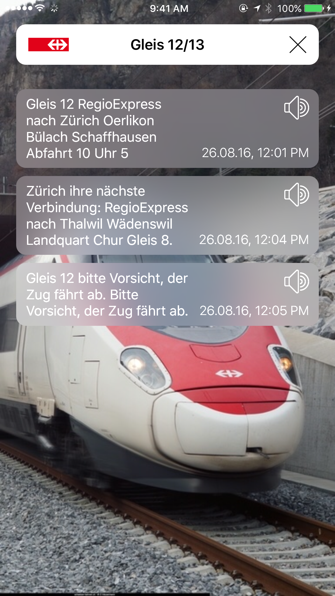

# SBB Zurich Loudspeaker Messages

	
	
	

## Make Zurich HB More Accessible
On my way to [HackZurich](https://www.hackzurich.com), I noticed a blind person that needed help to find the correct train. With this hack, I wanted to make the Zurich train stations more accessible to everyone. The loudspeaker messages are the best way to get up to date information about departues, connections, delays and much more. SBB provided an API to access these messages. 

I implemented the new iOS 10 Siri APIs to do speech recognizition to find out the platform on which the user is. Another way is to manually select it from the list. After selecting a platform, the user is presented with a list of the messages which can also played with the Siri voice.

## Requirements
iOS 10.0 and Swift 3.0 are required. It also uses Carthage.

## Author

I'm [Patrick Balestra](http://www.patrickbalestra.com).
Email: [me@patrickbalestra.com](mailto:me@patrickbalestra.com)
Twitter: [@BalestraPatrick](http://twitter.com/BalestraPatrick).

## License

`SBB Zurich Loudspeaker Messager` is available under the MIT license. See the [LICENSE](LICENSE) file for more info.